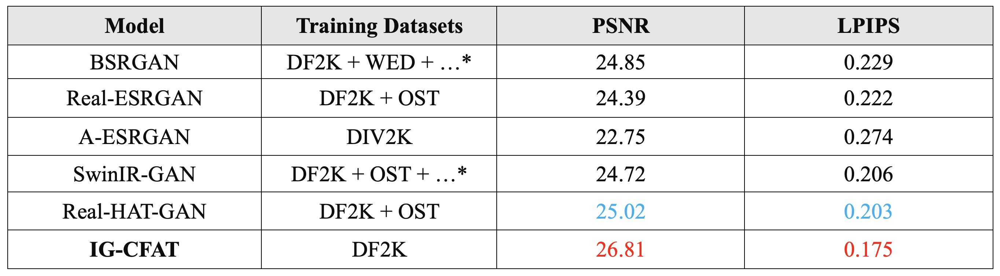
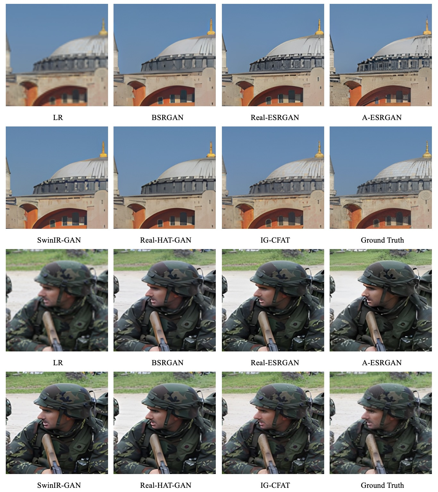
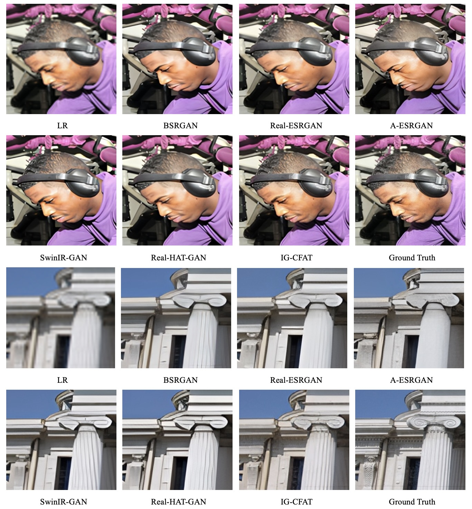

# IG-CFAT
[[Paper Link]](https://arxiv.org/abs/2406.13815)

Welcome to the official GitHub repository for IG-CFAT, an improved GAN-Based model for effectively exploiting transformers in real-world image super-resolution tasks. 

# Overview

In the field of single image super-resolution (SISR), transformer-based models have showcased remarkable progress. However, their application and efficiency in real-world image super-resolution are less noticed, presenting substantial opportunities for improvement. IG-CFAT bridges this gap by leveraging the strengths of some recent techniques to enhance real-world image super-resolution, surpassing existing state-of-the-art (SOTA) models.

# Key Features

- **Composite Fusion Attention Transformer (CFAT)**: Our model builds on the CFAT architecture, which has already demonstrated superior performance in classic image super-resolution tasks. [CFAT](https://github.com/rayabhisek123/CFAT)
- **Semantic-Aware Discriminator**: To reconstruct image details more accurately and significantly improve perceptual quality, IG-CFAT incorporates a semantic-aware discriminator. [SeD](https://github.com/lbc12345/SeD)
- **Adaptive Degradation Model**: We utilize an adaptive degradation model to better simulate real-world image degradations, making our approach more robust and effective. [DASR](https://github.com/csjliang/DASR) - [StarSRGAN](https://github.com/kynthesis/StarSRGAN)
- **Wavelet Losses**: By adding wavelet losses to the conventional loss functions used in GAN-based super-resolution models, IG-CFAT can reconstruct high-frequency details more efficiently. [Wavelettention](https://github.com/mandalinadagi/Wavelettention)

# Training Setup

## Installation

Clone the repository and navigate into the directory:

```bash
git clone https://github.com/alireza-aghelan/IG-CFAT
cd IG-CFAT
```

Install the basic dependencies:

```bash
pip install basicsr
pip install -r requirements.txt
python setup.py develop
```

Create and activate a new conda environment, then install PyTorch and CLIP:

```bash
conda create -n SeD python=3.9
conda activate SeD
pip install torch==1.9.0+cu111 torchvision==0.10.0+cu111 torchaudio==0.9.0 -f https://download.pytorch.org/whl/torch_stable.html
pip install git+https://github.com/openai/CLIP.git
```

# Training

## Train MSE Model (from scratch)

Run the following command to train the model using MSE loss:

```bash
python igcfat/train.py -opt /content/IG-CFAT/options/train/train_IG_CFAT_SRx4_mse_model.yml --auto_resume
```

## Fine-tune from MSE Model

Run the following command to fine-tune the model from a pre-trained MSE model:

```bash
python igcfat/train.py -opt /content/IG-CFAT/options/train/train_IG_CFAT_SRx4_finetune_from_mse_model.yml --auto_resume
```

# Testing

Run the following command to test the model:

```bash
python /content/IG-CFAT/igcfat/test.py -opt /content/IG-CFAT/options/test/IG_CFAT_SRx4.yml
```

# Results

Our experiments demonstrate that IG-CFAT sets new benchmarks in real-world image super-resolution, outperforming SOTA models in both quantitative and qualitative metrics. The results are shown in the following Figures.
<br><br>


Quantitative comparison between IG-CFAT and GAN-based SR methods.
<br><br>



Visual comparison of IG-CFAT with GAN-based SR methods.
<br><br>
Our code is built on [BasicSR](https://github.com/XPixelGroup/BasicSR), [CFAT](https://github.com/rayabhisek123/CFAT), and [HAT](https://github.com/XPixelGroup/HAT). Thanks to their great work.
